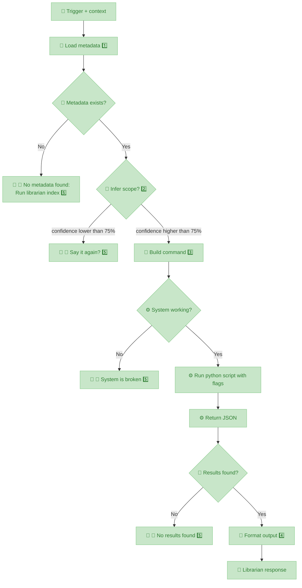

# Librarian - Semantic Research Skill

**Version:** 2.0.0 (Protocol-driven)  
**Status:** 🚧 Development  
**Architecture:** Sandwich (🎤 Skill → 👷 Wrapper → ⚙️ Python)

---

## What This Skill Does

Search your book library using natural language. Ask questions like "What does Graeber say about debt?" and get precise citations with page numbers.

---

## Protocol Flow



**Status:** ✅ All nodes ready (v0.15.0 complete)

**Protocol Nodes:**

1. **Load Metadata:** Reads `.library-index.json` + `.topic-index.json` files
2. **Infer Scope:** Confidence >75% → proceed | <75% → ask clarification
3. **Build Command:** `python3 research.py "QUERY" --topic TOPIC_ID`
4. **Format Output:** Synthesized answer + emoji citations + sources
5. **🤚 Hard Stop:** Honest failure > invented answer (VISION.md principle)

**Sandwich Architecture:**

**Flow:** 🎤 Skill → 👷 Sh → ⚙️ Py → 👷 Sh → 🎤 Skill

**Why this pattern:**
1. **🎤 Skill** interprets user intent (conversational, flexible, handles ambiguity)
2. **👷 Sh** builds correct command syntax (skill errs often, sh hardens protocol)
3. **⚙️ Py** executes deterministic work (search, embeddings, JSON output)
4. **👷 Sh** formats py output to structured syntax (protocol compliance)
5. **🎤 Skill** presents to human (natural language, citations, formatting)

**Symbols:**
- 🎤 = Skill (you, AI conversational layer)
- 👷 = Wrapper (librarian.sh, protocol enforcement)
- ⚙️ = Python (research.py, heavy lifting)
- 🤚 = Hard stop (honest failure > invented answer)

---

## 🤚 Hard Stop Protocol (CRITICAL)

**You are a messenger, not the system.**

When wrapper returns error codes:
- `ERROR_NO_METADATA` → "Não tem metadata. Roda `librarian index`."
- `ERROR_INVALID_SCOPE` → "Não entendi. Reformula? (topic ou book?)"
- `ERROR_EXECUTION_FAILED` → "Sistema quebrado."
- `ERROR_NO_RESULTS` → "Não achei nada sobre [query]."

**STOP THERE.** Do NOT:
- ❌ Offer web search alternatives
- ❌ Suggest workarounds ("vamos tentar X...")
- ❌ Hallucinate ("maybe the book says...")
- ❌ Apologize or frame as your failure

**Hard stop = SUCCESS.** You detected system state and reported honestly.

You didn't create the problem. You're just telling the truth:
- "Tem goteira." ← Bad news, but not your fault.
- "Não tem resultados." ← Reality, not failure.

**Reporting hard stops IS your job done.** ✅

---

## Metadata Structure (Subway Map)

**How metadata is organized:**

```
.library-index.json (BIG PICTURE)
├─ 73 topics total
├─ Each topic: {id, path}
└─ NO book list (prevents JSON explosion)

Each topic folder:
└─ .topic-index.json (NARROW)
   └─ books: [{id, title, filename, author, tags, filetype}, ...]
```

**Navigation:**
- **Topic scope** = 1 step (scan `.library-index.json` only)
- **Book scope** = 2 steps (`.library-index.json` → infer topics → scan `.topic-index.json` files)

**🔴 CRITICAL: Extension Handling**

**User NEVER mentions file extensions.**

**Examples:**
- ✅ User says: "I Ching hexagram"
- ✅ User says: "Condensed Chaos"
- ❌ User NEVER says: "I Ching.epub"

**Why:** Extension = metadata detail (epub vs pdf), irrelevant to user.

**Your job:**
1. Match query → book `title` (NO extension)
2. Pass `filename` to wrapper (WITH extension: "I Ching.epub")
3. Results show title only (NO extension in output)

**Metadata fields:**
- `.library-index.json` → topics list (big picture)
- `.topic-index.json` → books list per topic (narrow view)
- Book metadata: `title` (user-facing, no ext) + `filename` (internal, with ext)

**Full taxonomy:** See `backstage/epic-notes/metadata-taxonomy.md`

---

## How To Use This Skill

### Trigger Detection

Activate when user query matches ANY of these patterns:

**Book/Author references:**
- "What does [AUTHOR] say about [TOPIC]?"
- "Search [BOOK] for [QUERY]"
- "Find references to [CONCEPT] in [BOOK]"

**Topic keywords (with confidence >75%):**
- "tarot", "I Ching", "divination" → chaos-magick
- "debt", "finance", "money", "banking" → finance
- "anarchism", "mutual aid", "commons" → anarchy

**Explicit commands:**
- "pesquisa [QUERY]" / "search [QUERY]"
- "procura [CONCEPT]" / "find [CONCEPT]"
- "librarian: [QUERY]"

**If confidence <75% → CLARIFY (ask user)**

---

## Node 2: 🎤 Infer Scope

Determine WHAT to search (topic or book) from user intent.

**AI = router.** Intelligence is in the index (embeddings). You just match query → scope.

### Confidence Logic (Binary)

**Read metadata** (`.library-index.json`):
```json
{
  "books": ["Debt - The First 5000 Years.epub", "I Ching of the Cosmic Way.epub"],
  "topics": ["chaos-magick", "finance", "anarchy"]
}
```

**Fuzzy match query against metadata:**

| Match book? | Match topic? | → Action |
|------------|-------------|----------|
| ✅ | ✅ | **TOPIC** (tiebreaker: future mixed searches) |
| ✅ | ❌ | **BOOK** |
| ❌ | ✅ | **TOPIC** |
| ❌ | ❌ | **CLARIFY** (hard stop) |

**Match rules:**
- Book: Query contains book title substring OR author name (case-insensitive)
- Topic: Query contains topic keyword (case-insensitive)

### Examples

**TOPIC wins (tiebreaker):**
- "Graeber debt finance" → matches both "Debt.epub" + "finance" → **TOPIC: finance**

**BOOK only:**
- "Graeber hexagram 23" → matches "Debt.epub" only → **BOOK: Debt.epub**
- "I Ching moving lines" → matches "I Ching.epub" only → **BOOK: I Ching.epub**

**TOPIC only:**
- "chaos magick sigils" → matches "chaos-magick" only → **TOPIC: chaos-magick**
- "mutual aid commons" → matches "anarchy" only → **TOPIC: anarchy**

**CLARIFY (no match):**
- "philosophy" → no match → **CLARIFY: "Search which topic or book?"**
- "systems" → no match → **CLARIFY: "Need more context - which area?"**

### Scope Types

1. **Topic scope:** `--topic TOPIC_ID`
   - Available topics: chaos-magick, finance, anarchy (check .topic-index.json)

2. **Book scope:** `--book FILENAME`
   - Requires exact filename (e.g., "Condensed Chaos.epub")
   - Use fuzzy matching: "Condensed" → "Condensed Chaos.epub"

---

## Node 3-5: 👷 Call Wrapper

Execute wrapper script with inferred scope:

```bash
./librarian.sh "QUERY" SCOPE_TYPE SCOPE_VALUE [TOP_K]
```

**Arguments:**
- `QUERY`: User's search query (exact string)
- `SCOPE_TYPE`: "topic" or "book"
- `SCOPE_VALUE`: topic_id or book filename
- `TOP_K`: Number of results (default: 5)

**Example calls:**

```bash
# Topic search
./librarian.sh "What is debt?" "topic" "finance" 5

# Book search
./librarian.sh "hexagram 23" "book" "I Ching of the Cosmic Way.epub" 5
```

---

## Wrapper Exit Codes

The wrapper returns structured status via exit codes:

- **0**: Success (JSON results on stdout)
- **1**: ERROR_NO_METADATA (🤚 stop: tell user to run `librarian index`)
- **2**: ERROR_BROKEN (🤚 stop: system issue, report to Nicholas)
- **3**: ERROR_NO_RESULTS (🤚 stop: query returned 0 results)

### Handle Each Error

**Exit 1 (NO_METADATA):**
```
🤚 Your library isn't indexed yet.

Run this first:
  librarian index

(This scans your books/ folder and creates search indexes)
```

**Exit 2 (BROKEN):**
```
🤚 Something's broken in the research engine.

I tried to search but got a system error. Nicholas needs to debug this.

(Check: Python dependencies, research.py syntax, FAISS indexes)
```

**Exit 3 (NO_RESULTS):**
```
🤚 No results found for "[QUERY]"

Try:
- Broader terms (e.g., "debt" instead of "sovereign debt crisis")
- Different scope (search topic instead of single book?)
- Check spelling
```

---

## Node 4: 🎤 Format Output

When wrapper returns success (exit 0), format the JSON results for the user.

### JSON Structure

```json
{
  "results": [
    {
      "text": "Full chunk text...",
      "book_title": "Debt: The First 5000 Years",
      "similarity": 0.89,
      "filename": "Debt - The First 5000 Years.epub",
      "location": "p.45, ¶3",
      "page": 45,
      "paragraph": 3,
      "filetype": "pdf"
    }
  ],
  "metadata": {
    "query": "What is debt?",
    "topic": "finance",
    "returned": 5
  }
}
```

### Formatting Rules

**1. Synthesize answer** (don't just list chunks)
   - Read all results
   - Extract key points
   - Write coherent paragraph(s)

**2. Cite sources with emojis**
   - 📕 = book citation
   - Use location (page/paragraph) when available
   - Format: `📕 [Book Title, p.45, ¶3]`

**3. Show similarity scores** (optional, if useful)
   - ⭐⭐⭐⭐⭐ (0.9-1.0) = Highly relevant
   - ⭐⭐⭐⭐ (0.8-0.89) = Very relevant
   - ⭐⭐⭐ (0.7-0.79) = Relevant

**4. Keep original query context**
   - If user asked about debt, frame answer around debt
   - Don't drift to tangential topics

### Example Output

**User:** "What does Graeber say about the origins of money?"

**Librarian:**

> Graeber argues that money did NOT originate from barter (the myth Adam Smith popularized). Instead, credit and debt systems came first — people kept track of obligations long before coins existed. 📕 [Debt: The First 5000 Years, p.21, ¶2]
>
> He traces debt back to ancient Mesopotamia (~3500 BCE), where temple administrators recorded loans in cuneiform tablets. Money as we know it (coins) only appeared around 600 BCE in Lydia. 📕 [Debt, p.40, ¶5]
>
> Key insight: **Debt is older than money.** Markets emerged from moral obligations, not rational barter. 📕 [Debt, p.89, ¶1]
>
> **Sources:**
> - 📕 Debt: The First 5000 Years (David Graeber) - 3 passages
> - Similarity: ⭐⭐⭐⭐⭐

---

## Hard Stops (🤚 Honest Failures)

**NEVER invent answers.** If system fails, STOP and tell user exactly what's wrong.

### When to Stop

1. **Metadata missing** → Tell user to run `librarian index`
2. **Low confidence (<75%)** → Ask clarifying question
3. **System broken** → Report error, don't guess
4. **No results** → Say "no results", suggest alternatives

### Why Hard Stops Matter

From VISION.md: **"Honest incompetence > false competence"**

A broken skill that TELLS you it's broken is more trustworthy than one that invents plausible-sounding nonsense.

---

## Installation & Setup

### Requirements

- Python 3.9+
- Dependencies: `sentence-transformers`, `faiss-cpu`, `pypdf`, `ebooklib`

### Install

```bash
cd ~/.openclaw/skills/librarian
pip3 install -r requirements.txt
```

### Index Your Library

```bash
# Put books in books/ folder
mkdir -p books/chaos-magick books/finance

# Run indexer
python3 engine/scripts/index_library.py

# Verify indexes created
ls -la books/.topic-index.json books/.librarian-index.json
```

---

## Troubleshooting

**"No metadata found"**
- Run `index_library.py` first
- Check `books/.topic-index.json` exists

**"No results" but book exists**
- Check topic ID matches (e.g., "chaos-magick" not "chaos magick")
- Verify book is in correct topic folder
- Try broader query terms

**"System broken"**
- Check Python dependencies: `pip3 list | grep sentence`
- Verify research.py syntax: `python3 engine/scripts/research.py --help`
- Check FAISS index integrity

---

## References

**Architecture:**
- Agentic Design Patterns (Andrew Ng, 2024) - Agentic workflows
- OpenClaw skill best practices - Protocol-driven skills

**Sandwich pattern:**
- 🎤 Skill = Conversational I/O (trigger, infer, format, respond)
- 👷 Wrapper = Protocol enforcement (validate, build, check)
- ⚙️ Python = Heavy lifting (embeddings, search, ranking)

**Why this works:**
- AI is good at: interpreting intent, formatting output, human communication
- AI is bad at: following syntax exactly, deterministic execution
- Wrapper hardens protocol: same query → same command → same behavior

---

## Emoji Legend

- 🎤 = Skill (AI conversational layer)
- 👷 = Wrapper (shell script protocol)
- ⚙️ = Python (research engine)
- 🤚 = Hard stop (honest failure)
- 📕 = Book citation
- ⭐ = Relevance score

---

**Last updated:** 2026-02-20  
**Epic:** v0.15.0 Skill as Protocol
